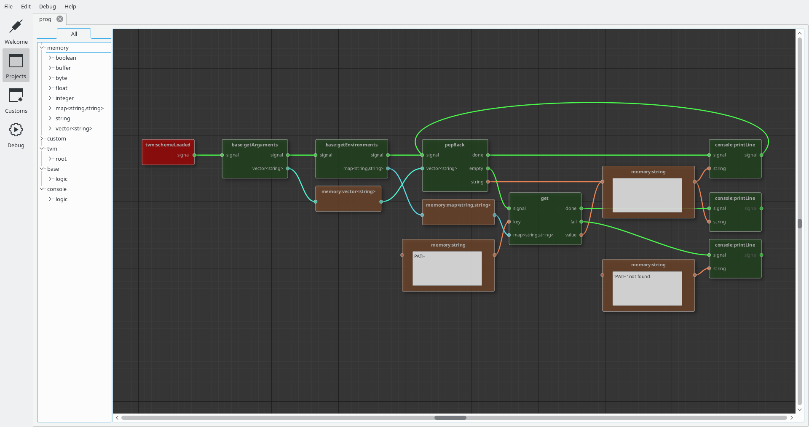

# TVM #

Header-only C++ Virtual Machine

# Quick Start #

Dependencies:
```sh
$ sudo apt install git make g++
```

Download sources:
```sh
$ git clone https://github.com/timonbl4/tvm.git
```

Build Virtual Machine (Example: "Step 4"):
```sh
$ cd tvm/examples/step_4_base_library
$ make
```

Run:
```sh
$ cd tvm/examples/step_4_base_library
$ ./step_4_base_library abc1 def2
def2
abc1
./step_4_base_library
/usr/bin:/sbin:/bin
```

### Build Project Editor (GUI) ###



Dependencies:
```sh
$ sudo apt install git build-essential cmake qtbase5-dev
```

Update submodules:
```sh
$ cd tvm
$ git submodule update --init
```

Build IDE (Example: "Step 4"):
```sh
$ cd tvm/examples/step_4_base_library/gui
$ mkdir build
$ cd build
$ cmake ../
$ make -j4
```

Run:
```sh
$ cd tvm/examples/step_4_base_library/gui/build
$ ./gui
```

Open TVM Project `tvm/examples/step_4_base_library/prog.tvmproject`
